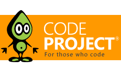

JSOTP
=====

Compact One Time Password Generator (RFC6238)

#Introduction

In one of previous articles I've briefly demonstrated how OTP value is calculated
(http://labs.voronenko.info/109454540) as well as shared compact set of PHP classes and libraries
that allow OTP calculation in your server side code (http://labs.voronenko.info/php-implementation-of-the-otp-algorythm-77519).
This approach assumed that you want your customer to use google authenticator tool in order to get the OTP value.
For example, such approach is used by LastPass password service. But what if you want some customized UI for OTP token generator?
You might need want this UI to be branded with your application/service skin, etc?

This article will show how to deal with it.

#Background

The OTP token generator program is usually an application on some mobile device: IOS or Android based.
Both platforms support HTML5 very well, and this allows us to implement our OTP generator in pure HTML/Javascript,
as a single page application.

## Challenges to solve
  * Implement OTP token generation in javascript
  * Implement UI and logic to change the code each 30 seconds
  * Ensure that implemented solution is capable working in offline.

Let's go step by step.

## OTP token generation in javascript.
As you might recall from by previous article we need following ingridients for our algorythm:

* base32 conversion library,
* sha1 cryptho algorythm implementation
* HMAC & OTP algorythm implementation if present.

We prefer libraries with MIT or lGPL licenses in order to be able to license our solution as free for commercial use.
For base32 implementation I definitely recommend nibbler library: http://www.tumuski.com/2010/04/nibbler/ it has minor
glitches with padding, but the issue is rare and community patch is present.

For Sha1 algorythm and other cryptho algorythms in javascript I recommend CryptoJS library by google
http://code.google.com/p/crypto-js/. CryptoJS is a growing collection of standard and secure cryptographic algorithms
implemented in JavaScript using best practices and patterns. They are fast, and they have a consistent and simple
interface. Library is still supported and developed at the present moment. We can find there both sha1 and hmac
implementations - brilliant!

OTP algorythm: Javascript becomes quite popular now: for example we can use this NodeJS module as a basis
https://github.com/guyht/notp/ . The issue is that module designed specifically for NodeJS environment, thus
all not important dependencies need to be eliminated in order to allow this module work in a browser environment.
MIT license allows us to do such modifications.

In this case I had to do a port of the Buffer object, use nibbler implementation for base32 and emulate NodeJS crypto
module (http://nodejs.org/api/crypto.html)for HMAC calculation.

var cryptoFAKE = {
   createHmac:function(algorithm, key) {
      var _key = key.value();
      return new HMacBasicImpl(_key);
   }
};

As a result, in order to calculate OTP value using adopted code, we need to call

Notp.getTOTP (args, err, cb)

Arguments: object with required field K - private key string

## UI
For UI we have to answer on following questions:
  * Where will we store the key (referred as a CLUE in this section)
  * How will we program the UI.

Fortunately HTML5 allows web pages to persist their data on the client device -
DOM Storage https://developer.mozilla.org/en-US/docs/DOM/Storage.

 var CLUE= localStorage.getItem('CLUE');
    if (typeof(CLUE)=="undefined") {
       CLUE=null;
    }

For Single Page Applications my favorite library is KnockoutJS. It allows to concentrate on developing logic,
and outsource binding to html elements on Knockout markup.

Model: has three properties: clue (the key), current token and boolean property that informs whenever clue is present or not.
one method - UpdateToken - calculates OTP and updates model properties.

  var Model = {
       existsclue:ko.observable((CLUE!=null)),
       clue:  ko.observable(CLUE),
       token: ko.observable('XXXXXXX'),
       notp: new Notp(),
       UpdateTokenCallback: function(code) {
         this.token(code);
       },

       UpdateToken: function(){

          var args = {
		K : CLUE
        	};

            this.notp.getTOTP(args,
        	function(err) { alert(err); },
                Model.UpdateTokenCallback.bind(Model)
            );
       }
    }

View:
<pre>
    <header aria="company logo">
       

    </header>
    

       
LOADING...

       
CLUE
()
       

          <a href="setup.php">Please navigate to this link to setup your device!</a>
       

       

          <a href="#" onclick="window.applicationCache.update()">Debug: cache.swapCache()</a>
       

    

</pre>

we are detecting whenever CLUE is present in localstorage, and if not - propose our customer to setup
("Please navigate to this link to setup your device"). In a real scenario we might want person to login using some secure
method, but for demo purposes we use simple approach: put clue in the session and display QR code that can be grabbed
by client device.
<pre>
<?php

require_once(dirname(__FILE__) . DIRECTORY_SEPARATOR .'rfc6238/base32static.php');
session_start();
$secretcode = '12345678901234567890';
$_SESSION['secretcode'] = $secretcode;
;

$url = "http://".$_SERVER["HTTP_HOST"].str_replace(basename($_SERVER["SCRIPT_NAME"]),"",$_SERVER["SCRIPT_NAME"])."setupinitdevice.php?PHPSESSID=".$_COOKIE["PHPSESSID"];

?>
<h1> Please navigate by link below to setup 2 factor auth </h1>
" />
 

<a href="<?php print $url?>">This is the same link for debug</a>
</pre>

Once link is opened on device using QR Code or in a different way, - device is configured.
<pre>
<?php
  session_start();
  $secretcode = $_SESSION['secretcode'];
  if (empty($secretcode)) {
    die('Sorry, device is not supported /'.$_COOKIE["PHPSESSID"].'/ while'.session_id(). '  AND #'.$_SESSION['secretcode'].'#');
  }

  $url = "http://".$_SERVER["HTTP_HOST"].str_replace(basename($_SERVER["SCRIPT_NAME"]),"",$_SERVER["SCRIPT_NAME"])."index.html";
?>
<html>
  <head>
    <meta http-equiv="refresh" content="2;url=<?php print $url?>">
    
  </head>
  <body>
    <a href="<?php print $url?>">If this page did not redirect you, press here</a>
  </body>
</html>
</pre>

#Using the code

A brief description of how to use the article or code. The
class names, the methods and properties, any tricks or tips.
Blocks of code should be set as style "Formatted"

#Points of Interest

Did you learn anything interesting/fun/annoying while writing
the code? Did you do anything particularly clever or wild or zany?

#History

Keep a running update of any changes or improvements you've
made here.